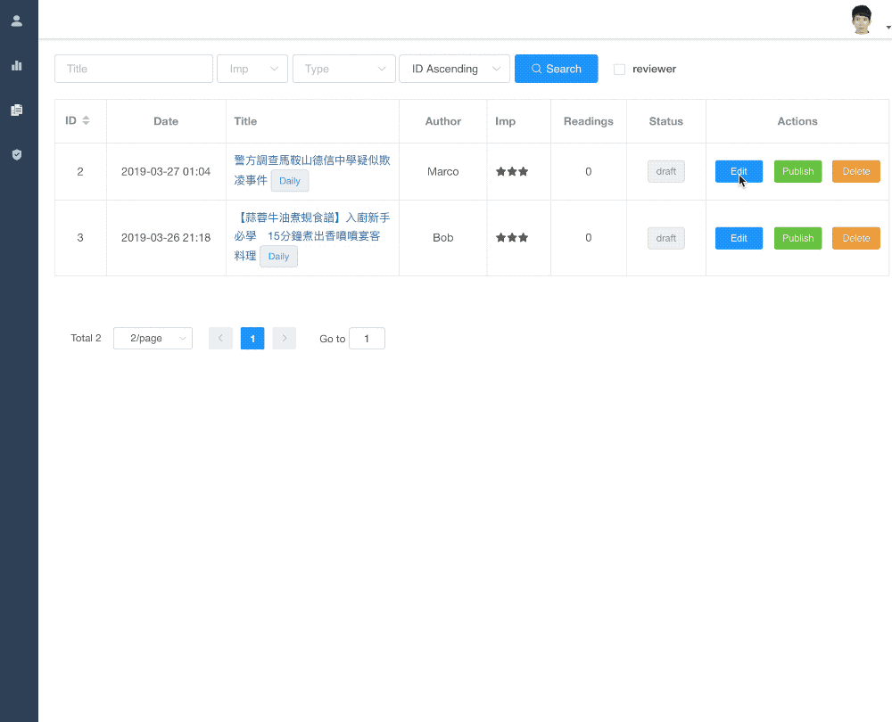
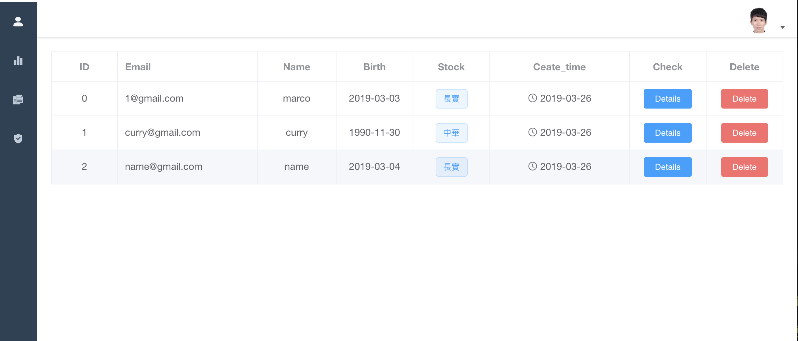

# financial_management

## A background management of [financial_web](https://github.com/chowchunlok/financial_web/tree/master)

> ### Introduction
>
> A background management with permission control & token-based authentication
>
> ### Skill
>
> Vue + Express + Mongoose

## Build Setup

```bash
# Clone project
git clone git@github.com:chowchunlok/financial_management.git

# Install dependencies
npm install

# Serve with hot reload at localhost:9000
npm run dev

# Build for production with minification
npm run build

```

## Main Function

1. Log In/Log Out
   - Every page needs valid token
   - Save token in cookie
   - vuex


2. Permission Control

- Different Roles can read different pages (admin role has register page but editor role)


3. Edit Article
   - article's different status: [published/draft/delete]
   - only admin can delete article from database(editor just delete online)
   - pagenation
   - comments(add in furture...)



4. Check User


